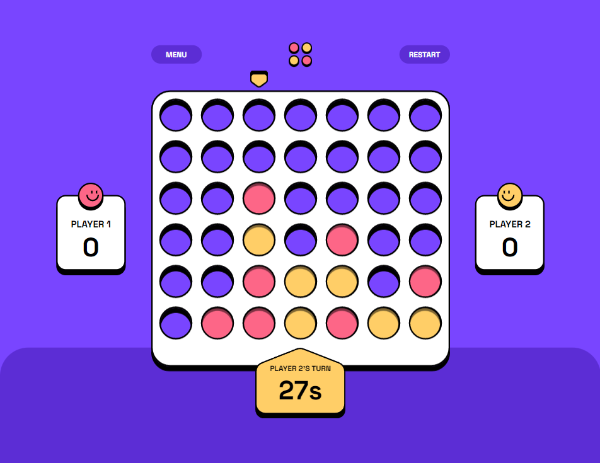
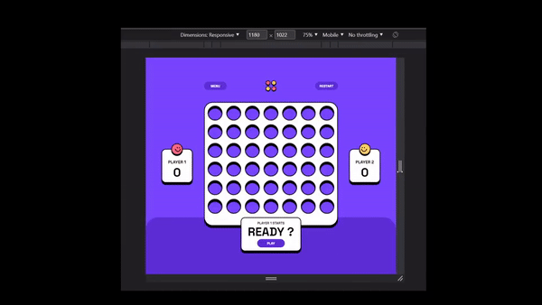

Live site: https://GuruAshwin.github.io/ConnectFour-main/

# Frontend Mentor - Connect Four game solution

This is a solution to the [Connect Four game challenge on Frontend Mentor](https://www.frontendmentor.io/challenges/connect-four-game-6G8QVH923s). Frontend Mentor challenges help you improve your coding skills by building realistic projects. 

## Table of contents

- [The challenge](#the-challenge)
- [My process](#my-process)
  - [Built with](#built-with)
  - [What I learned](#what-i-learned)
  - [Continued development](#continued-development)
- [Author](#author)

## The challenge

Users should be able to:

- View the game rules
- Play a game of Connect Four against another human player (alternating turns on the same computer)
- View the optimal layout for the interface depending on their device's screen size
- See hover and focus states for all interactive elements on the page
- See the discs animate into their position when a move is made
- Play against the computer
- Control the game with keyboard (Arrow keys and SpaceBar)

## My process

### Built with

- Object Oriented JavaScript
- CSS components workflow
- Flexbox

### What I learned

I experimented displaying game data with pseudo elements `content` property, allowing simpler markup and CSS selectors controlling content format.

The project included 3 distinct layouts, the grid had to keep an aspect-ratio and all the UI should fit in 100% of the height unlike usual webpages.
The game should perfectly fit any viewport above `360x580`. 

Future media queries will make this much simpler:

Flexbox was very handy for resizing UI proportionally on different viewports.
`flex-basis` is easier to implement from figma, more explicit and accurate than `height%`.

An other tool for supporting different viewports was `clamp()`.
Let's say I wanted a `font-size` to progressively reduce from 56px at `viewport height = 880px` to 32px at `viewport height = 580px`.
You can calculate the linear equation from 2 points (880, 56) and (580, 32) with the formula or an online calculator and get the result in `vh + px` format.

It was also a good opportunity to use `min()` instead of `height` and `min-height`.

I used the combination of `margin-inline-start` and `direction` to make my CSS less redundant.

I used `:is()` to make some selectors shorter.

I used `:where()` to impose a low specifity.
The same `.info` element is used for text before game starts and after game ends.

### Continued development

The current "CPU Opponent" only has a basic defensive strategy. Advanced algorithm for perfect play exists but would leave no chance for the player. Maybe we could have a submenu for CPU strength selection "Easy, Medium, Hard".

Having the game work with a shareable link to play Online PVP could be interesting!
We could use the same submenu to select either "Local PVP" or "Online PVP".

## Author
-B Ashwin
- Frontend Mentor - [@jeanwll](https://www.frontendmentor.io/profile/jeanwll)
